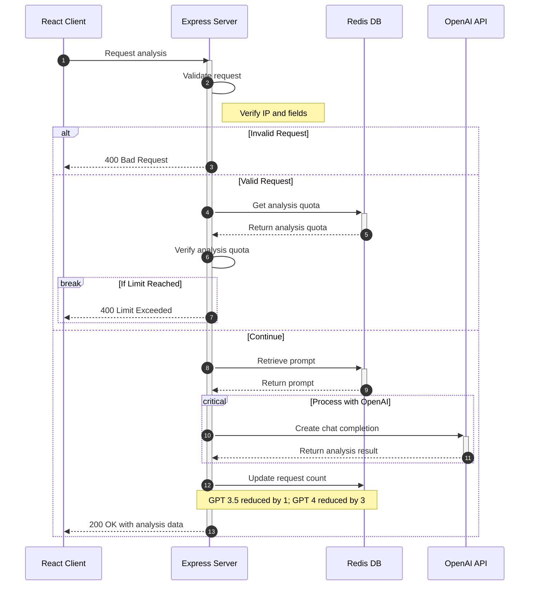

> OpenAI API를 이용한 영어 구문 분석 / 편집기
> 
- 배포 링크 : [https://syntax-analyzer.romantech.net](https://syntax-analyzer.romantech.net/)
- 백엔드 레포지토리 : https://github.com/romantech/project-server

# 사용 스택
### Frontend

- **Framework**: React with Typescript
- **UI Library**: Chakra UI
- **CSS Preprocessor**: SCSS
- **Animation**: Framer Motion / Lottie
- **State Management**: Jotai / React Query
- **Form Handling**: React Hook Form / Yup

### Backend

- **Framework**: Express with Typescript
- **Database & Cache**: Redis (using ioredis)

# 주요 기능
1. 영어 구문 분석 : 주어, 동사, 목적어, 절, 구 등 문장 요소 분석
2. 영어 구문 편집기 : 30여 가지 문장 요소 태그를 이용해 문장 구조 시각화
3. 영어 문장 생성 : 입력한 주제와 연관된 랜덤 문장 생성

# 분석 데이터 생성 흐름

# 스크린샷
#### 홈 화면

#### 영어 구문 분석 요청 양식

#### 영어 구문 편집기

#### 랜덤 문장 생성

