> OpenAI API를 이용한 영어 구문 분석 / 편집기
> 
- 배포 링크 : [https://syntax-analyzer.romantech.net](https://syntax-analyzer.romantech.net/)
- 백엔드 레포지토리 : https://github.com/romantech/project-server

# 사용 스택
### Frontend

- **Framework**: React with Typescript
- **UI Library**: Chakra UI
- **CSS Preprocessor**: SCSS
- **Animation**: Framer Motion / Lottie
- **State Management**: Jotai / React Query
- **Form Handling**: React Hook Form / Yup

### Backend

- **Framework**: Express with Typescript
- **Database & Cache**: Redis (using ioredis)

# 주요 기능
1. 영어 구문 분석 : 주어, 동사, 목적어, 절, 구 등 문장 성분 분석
2. 영어 구문 편집기 : 30여 가지 구성 요소 태그를 이용한 문장 구조 시각화
3. 영어 문장 생성 : 입력한 주제와 연관된 랜덤 문장 생성

# 분석 데이터 생성 흐름

```mermaid
sequenceDiagram
    autonumber
    
    participant C as React Client
    participant S as Express Server
    participant R as Redis DB
    participant O as OpenAI API

    C->>S: Request analysis #32;#32;

    activate S

    S->S: Validate request
    Note right of S: Verify IP and fields #32;

    alt Invalid Request
        S-->>C: 400 Bad Request

    else Valid Request
        S->>+R: Get analysis quota
        R-->>-S: Return analysis quota
        S->S: Verify analysis quota
        
        break If Limit Reached
            S-->>C: 400 Limit Exceeded
        end
        
        else Continue
            S->>+R: Retrieve prompt
            R-->>-S: Return prompt

            critical Process with OpenAI
                S->>+O: Create chat completion
                O-->>-S: Return analysis result
            end

            S->>R: Update request count
            Note over S,R: GPT 3.5 reduced by 1#59; GPT 4 reduced by 3 #32;#32;#32;
            
            S-->>C: 200 OK with analysis data
            deactivate S
    end
```

# 문장 성분 리스트
| label | abbreviation | type | description |
| --- | --- | --- | --- |
| 주어 | s | token | 문장에서 동작이나 상태의 주체를 나타내는 단어나 구 |
| 동사 | v | token | 문장에서 동작, 상태, 또는 사건을 표현하는 단어 |
| 조동사 | aux.v | token | 다른 동사와 함께 사용되어 동작, 상태, 관계를 나타내는 동사 |
| 법조동사 | mod.v | token | 가능성, 허락, 의무 등을 나타내는 동사 |
| 목적어 | o | token | 동사의 동작이나 상태에 영향을 받는 단어나 구 |
| 간접 목적어 | i.o. | token | 동사의 동작이 미치는 대상을 나타내는 단어나 구 |
| 직접 목적어 | d.o. | token | 동사의 동작이 직접적으로 영향을 주는 단어나 구 |
| 전치사 목적어 | prp.o. | token | 전치사에 의해 소개되는 단어나 구 |
| 보어 | c | token | 주어나 목적어를 설명하거나 보완하는 단어나 구 |
| 목적보어 | o.c. | token | 목적어를 설명하거나 보완하는 단어나 구 |
| to부정사 | t-inf | token | 'to'와 함께 사용되는 동사의 기본형 |
| 부정사 목적어 | inf.o. | token | 부정사 동사의 동작이나 상태에 영향을 받는 단어나 구 |
| 동명사 | g | token | 동사에 -ing 형태를 더해 명사로 사용하는 형태 |
| 동명사 목적어 | g.o. | phrase | 동명사의 동작이나 상태에 영향을 받는 단어나 구 구문 |
| 분사 | pt | token | 동사의 과거 분사나 현재 분사 형태 |
| 분사 목적어 | pt.o. | phrase | 분사 동작의 대상이 되는 단어나 구 구문 |
| 분사 구문 | pt.phr | phrase | 분사와 그 관련 구성요소로 이루어진 구문 |
| 전치사구 | prp.phr | phrase | 전치사와 그 객체로 이루어진 구문 |
| 부사구 | adv.phr | phrase | 문장 내에서 부사의 역할을 하는 구문 |
| 형용사구 | adj.phr | phrase | 문장 내에서 형용사의 역할을 하는 구문 |
| 등위어 | co.t | token | 동일한 중요도를 가진 두 개 이상의 단어나 구 구문 |
| 등위절 | co.cl | clause | 동일한 중요도를 가진 두 개 이상의 절 |
| 병렬절 | p.cl | clause | 동일한 문법 구조를 갖는 두 개 이상의 절 |
| 명사절 | n.cl | clause | 문장 내에서 명사의 역할을 하는 절 |
| 형용사절 | adj.cl | clause | 문장 내에서 형용사의 역할을 하는 절 |
| 부사절 | adv.cl | clause | 문장 내에서 부사의 역할을 하는 절 |
| 삽입절 | i.cl | clause | 문장 중간에 끼어들어 주로 추가적인 정보를 제공하는 절 |
| 관계절 | rel.cl | clause | 앞선 단어나 구를 수정하거나 설명하는 절 |
| 의존절 | dep.cl | clause | 다른 절에 의존하는 절 |
| 독립절 | ind.cl | clause | 문장의 다른 부분에 의존하지 않고 독립적으로 의미를 전달하는 절 |

# 스크린샷
#### 홈 화면

#### 영어 구문 분석 요청 양식

#### 영어 구문 편집기

#### 랜덤 문장 생성

